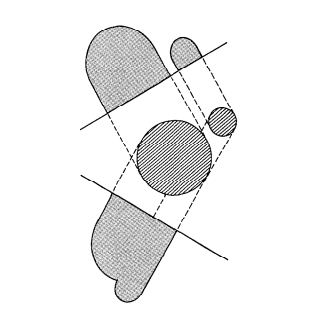

Introduction
------------

  Tomography refers to the cross-sectional imaging of an object from either transmission or reflection data collected by illuminating the object from many different directions. The impact of this technique in diagnostic medicine has been revolutionary, since it has enabled doctors to view internal organs with unprecedented precision and safety to the patient. The first medical application utilized x-rays for forming images of tissues based on their x-ray attenuation coefficient. More recently, however, medical imaging has also been successfully accomplished with radioisotopes, ultrasound, and magnetic resonance; the imaged parameter being different in each case.

  There are numerous nonmedical imaging applications. which lend themselves to the methods of computerized tomography. Researchers have already applied this methodology to the mapping of underground resources via crossborehole imaging, some specialized cases of cross-sectional imaging for nondestructive testing, the determination of the brightness distribution over a celestial sphere, and three-dimensional imaging with electron microscopy.

  Fundamentally, tomographic imaging deals with reconstructing an image from its projections. In the strict sense of the word, a projection at a given angle is the integral of the image in the direction specified by that angle, as illustrated in Fig. 1.1. However, in a loose sense, projection means the information derived from the transmitted energies, when an object is illuminated from a particular angle; the phrase “diffracted projection” may be used when energy sources are diffracting, as is the case with ultrasound and microwaves.

  Although, from a purely mathematical standpoint, the solution to the problem of how to reconstruct a function from its projections dates back to the paper by Radon in 1917, the current excitement in tomographic imaging originated with Hounsfield’s invention of the x-ray computed tomographic scanner for which he received a Nobel prize in 1972. He shared the prize with Allan Cormack who independently discovered some of the algorithms. His invention showed that it is possible to compute high-quality cross-sectional images with an accuracy now reaching one part in a thousand in spite of the fact that the projection data do not strictly satisfy the theoretical models underlying the efficiently implementable reconstruction algorithms. His invention also showed that it is possible to process a very large number of measurements (now approaching a million for the case of x-ray tomography) with fairly complex mathematical operations, and still get an image that is incredibly accurate.

 
  It is perhaps fair to say that the breakneck pace at which x-ray computed tomography images improved after Hounsfield’s invention was in large measure owing to the developments that were made in reconstruction algorithms. Hounsfield used algebraic techniques, described in Chapter 7, and was able to reconstruct noisy looking 80 x 80 images with an accuracy of one part in a hundred. This was followed by the application of convolution-backprojection algorithms, first developed by Ramachandran and Lakshminarayanan [Ram711] and later popularized by Shepp and Logan [She74], to this type of imaging. These later algorithms considerably reduced the processing time for reconstruction, and the image produced was numerically more accurate. As a result, commercial manufacturers of x-ray tomographic scanners started building systems capable of reconstructing 256 x 256 and 512 x 512 images that were almost photographically perfect (in the sense that the morphological detail produced was unambiguous and in perfect agreement with the anatomical features). The convolution-backprojection algorithms are discussed in Chapter 3.

  Given the enormous success of x-ray computed tomography, it is not surprising that in recent years much attention has been focused on extending this image formation technique to nuclear medicine and magnetic resonance on the one hand; and ultrasound and microwaves on the other. In nuclear medicine, our interest is in reconstructing a cross-sectional image of radioactive isotope distributions within the human body; and in imaging with magnetic resonance we wish to reconstruct the magnetic properties of the object. In both these areas, the problem can be set up as reconstructing an image from its projections of the type shown in Fig. 1.1. This is not the case when ultrasound and microwaves are used as energy sources; although the  aim is the same as with x-rays, viz., to reconstruct the cross-sectional image of, say, the attenuation coefficient. X-rays are nondiffracting, i.e., they travel in straight lines, whereas microwaves and ultrasound are diffracting. When an object is illuminated with a diffracting source, the wave field is scattered in practically all directions, although under certain conditions one might be able to get away with the assumption of straight line propagation; these conditions being satisfied when the inhomogeneities are much larger than the wavelength and when the imaging parameter is the refractive index. For situations when one must take diffraction effects (inhomogeneity caused scattering of the wave field) into account, tomographic imaging can in principle be accomplished with the algorithms described in Chapter 6.

  This book covers three aspects of tomography: Chapters 2 and 3 describe the mathematical principles and the theory. Chapters 4 and 5 describe how to apply the theory to actual problems in medical imaging and other fields. Finally, Chapters 6, 7, and 8 introduce several variations of tomography that are currently being researched.

  During the last decade, there has been an avalanche of publications on different aspects of computed tomography. No attempt will be made to present a comprehensive bibliography on the subject, since that was recently accomplished in a book by Dean [Dea83]. We will only give selected references at the end of each chapter, their purpose only being to cite material that provides further details on the main ideas discussed in the chapter.

  The principal textbooks that have appeared on the subject of tomographic imaging are [Her80], [Dea83], [Mac83], [Bar8 11]. The reader is also referred to the review articles in the field [Gor74], [Bro76], [Kak79] and the two special issues of IEEE journals [Kak81], [Her83]. Reviews of the more popular algorithms also appeared in [Ros82], [Kak84], [Kak85], [Kak86].