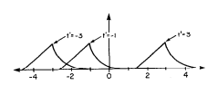
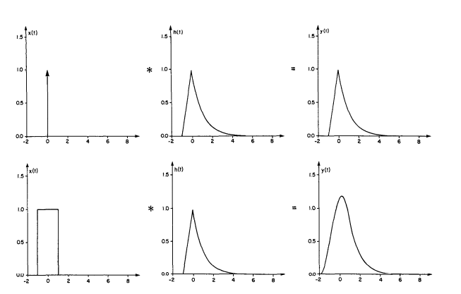
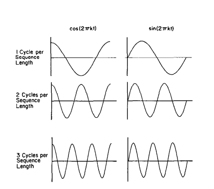
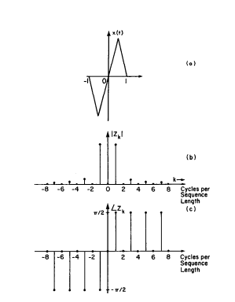
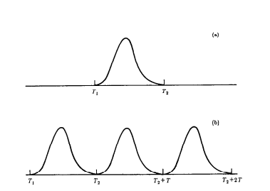

One-Dimensional Signal Processing
---------------------------------

###Continuous and Discrete One-Dimensional Functions

  One-dimensional continuous functions, such as in Fig. 2.1(a), will be
represented in this book by the notation

$$x(t)$$

where $$x(t)$$ denotes the value as a function at $$t$$. This function may be given a discrete representation by sampling its value over a set of points as illustrated in Fig. 2.1(b). Thus the discrete representation can be expressed as the list

$$ \cdot\cdot\cdot, x(-\tau), x(0), x(\tau), x(2\tau), \cdot\cdot\cdot,x(n\tau) \cdot\cdot\cdot$$

As an example of this, the discrete representation of the data in Fig. 2.1(c) is

$$1, 3, 4, 5, 4, 3, 1$$

It is also possible to represent the samples as a single vector in a multidimensional space. For example, the set of seven samples could also be represented as a vector in a 7-dimensional space, with the first element of the vector equal to 1, the second equal to 3, and so on.

  There is a special function that is often useful for explaining operations on functions. It is called the Dirac delta or impulse function. It can’t be defined directly; instead it must be expressed as the limit of a sequence of functions. First we define a new function called rect (short for rectangle) as follows

$$ rect\>(t) =
\left\{
 \begin{array}{lr}
   1 \quad |t| < \frac{1}{2}\\
   0 \quad elsewhere
 \end{array}
\right.
$$

This is illustrated in Fig. 2.2(a). Consider a sequence of functions of ever decreasing support on the t-axis as described by

$$\delta_n(t) = n \> rect \> (nt)$$

and illustrated in Fig. 2.2(b). Each function in this sequence has the same area but is of ever increasing height, which tends to infinity as $$ n \to \infty$$. The limit of this sequence of functions is of infinite height but zero width in such a manner that the area is still unity. This limit is often pictorially represented as shown in Fig. 2.2(c) and denoted by $$\delta(t)$$. Our explanation leads to the definition of the Dirac delta function that follows

$$\int_{-\infty}^{\infty}\delta(t)dt = 1$$

  The delta function has the following “sampling” property

$$\int_{-\infty}^{\infty}x(t)\delta(t-t')dt = x(t')$$

where $$\delta(t-t')$$  is an impulse shifted to the location $$t = t’$$ . When an impulse enters into a product with an arbitrary $$x(t)$$, all the values of $$x(t)$$ outside the location $$t = t’$$ are disregarded. Then by the integral property of the delta function we obtain (7); so we can say that $$\delta(t-t')$$ samples the function $$x(t)$$ at $$t’$$.

###Linear Operations

  Functions may be operated on for purposes such as filtering, smoothing, etc. The application of an operator $$O$$ to a function $$x(t)$$ will be denoted by

$$O[x(t)]$$

The operator is linear provided

$$O[\alpha x(t)+\beta y(t)]=\alpha O[x(t)]+\beta O[y(t)]$$

for any pair of constants $$\alpha$$ and $$\beta$$ and for any pair of functions $$x(t)$$ and $$y(t)$$.
  
  An interesting class of linear operations is defined by the following integral form

$$z(t)=\int_{-\infty}^{\infty}x(t')h(t,t')dt'$$

where $$h$$ is called the impulse response. It is easily shown that $$h$$ is the system response of the operator applied to a delta function. Assume that the input function is an impulse at $$t = t_0$$ or

$$x(t)=\delta(t-t_0)$$

Substituting into (10), we obtain

$$z(t)=\int_{-\infty}^{\infty}\delta(t-t_0)h(t,t')dt'$$

Therefore $$h(t, t')$$ can be called the impulse response for the impulse applied at $$t'$$.

  A linear operation is called shift invariant when

$$y(t)=O[x(t)]$$

implies

$$y(t-\tau)=O[x(t-\tau)]$$

or equivalently

$$h(t, t')=h(t-t')$$

This implies that when the impulse is shifted by $$t'$$, so is the response, as is further illustrated in Fig. 2.3. In other words, the response produced by the linear operation does not vary with the location of the impulse; it is merely shifted by the same amount.

  For shift invariant operations, the integral form in (10) becomes
  
$$z(t)=\int_{-\infty}^{\infty}x(t')h(t-t')dt'$$
  
This is now called a convolution and is represented by

$$z(t) = x(t)*h(t)$$

The process of convolution can be viewed as flipping one of the two functions, shifting one with respect to the other, multiplying the two and integrating the product for every shift as illustrated by Fig. 2.4.

  Convolution can also be defined for discrete sequences. If

$$x_i=x(i\tau)$$

and

$$y_i=y(i\tau)$$

then the convolution of $$x_i$$ with $$y_i$$ can be written as

$$y_i = \tau \sum\limits_{j=-\infty}^\infty x_jh_{i-j}$$

This is a discrete approximation to the integral of (17).

###Fourier Representation

  For many purposes it is useful to represent functions in the frequency domain. Certainly the most common reason is because it gives a new perspective to an otherwise difficult problem. This is certainly true with the convolution integral; in the time domain convolution is an integral while in the frequency domain it is expressed as a simple multiplication.
  
  In the sections to follow we will describe four different varieties of the Fourier transform. The continuous Fourier transform is mostly used in theoretical analysis. Given that with real world signals it is necessary to periodically sample the data, we are led to three other Fourier transforms that approximate either the time or frequency data as samples of the continuous functions. The four types of Fourier transforms are summarized in Table 2.1.

**Table 2.1**:Four different Fourier transforms can be defined by sampling the time and frequency domains.

|                      | Continuous Time | Discrete Time |
|----------------------|-----------------|---------------|
| Continuous Frequency |Name: Fourier Transform   Forward:$$\>X(\omega)=\int_{-\infty}^{\infty}x(t)e^{-j\omega t}dt$$   Inverse: $$x(t)= 1/2\int_{-\infty}^{\infty}X(\omega)e^{j\omega t}d\omega$$   Periodicity: None|Name: Discrete Fourier Transform   Forward:$$\>X(\omega)=\sum\limits_{n = -\infty}^{\infty}x(n\tau)e^{-j\omega n\tau}$$   Inverse: $$x(n\tau)= \tau/2\pi\int_{-\pi/\tau}^{\pi/\tau}X(\omega)e^{j\omega n\tau}d\omega$$   Periodicity: $$X(\omega) = X(\omega + i(2\pi/\tau))$$|
| Discrete Frequency   |Name: Fourier Series   Forward:$$\>X_n=1/T\int_{0}^{T}x(t)e^{-jn(2\pi/T)t}dt$$   Inverse: $$x(t)= \sum\limits_{n = -\infty}^{\infty}X_ne^{jn(2\pi/T)t}$$   Periodicity: $$x(t)=x(t+iT)$$|Name: Discrete Fourier Transform   Forward:$$\>X_k=1/N\sum\limits_{n = 0}^{N}x_ne^{-j(2\pi/N)kn}$$   Inverse: $$x_k= \sum\limits_{n = 0}^{N}X_ne^{j(2\pi/N)kn}$$   Periodicity: $$x_k=x_{k+iN}$$ and $$X_k = X_{k+iN}$$|

  Assume that we have a continuous function $$x(t)$$ defined for $$T_1 \leq t \leq T_2$$. This function can be expressed in the following form:

$$x(t) = \sum\limits_{k=-\infty}^\infty z_ke^{jk\omega_0t}$$

where $$j = \sqrt{-1}$$ and $$w_0 - 2\pi f_0 - 2\pi/T$$, $$T - T_2 - T_1$$, and $$z_k$$ are complex coefficients to be discussed shortly. What is being said here is that $$x(t)$$ is the sum of a number of functions of the form

$$e^{jkw_0t}$$

This function represents

$$e^{jkw_0t} = cos (kw_0t) + j\>sin (kw_0t)$$

The two functions on the right-hand side, commonly referred to as sinusoids, are oscillatory with $$kf_0$$ cycles per unit of $$t$$ as illustrated by Fig. 2.5. $$kf_0$$ is called the frequency of the sinusoids. Note that the sinusoids in (24) are at multiples of the frequency $$f_0$$, which is called the fundamental frequency.

The coefficients $$z_k$$ in (22) are called the complex amplitude of the $$k$$th component, and can be obtained by using the following formula

$$z_k = \frac{1}{T}\int_{T_1}^{T_2}(t)e^{-jkw_0T}dt$$

The representation in (22) is called the Fourier Series. To illustrate pictorially the representation in (22), we have shown in Fig. 2.6, a triangular function and some of the components from the expansion.

  A continuous signal $$x(t)$$ defined for $$t$$ between $$-\infty$$ and $$\infty$$ also possesses another Fourier representation called the continuous Fourier transform and defined by

$$X(\omega) = \int_{-\infty}^{\infty} x(t)e^{-j\omega t}dt$$

One can show that this relationship may be inverted to yield

$$x(t) = \frac{1}{2\pi}\int_{-\infty}^{\infty} X(\omega)e^{-j\omega t}d\omega$$

Comparing (22) and (27), we see that in both representations, $$x(t)$$ has been expressed as a sum of sinusoids, $$e^{j\omega t}$$; the difference being that in the former, the frequencies of the sinusoids are at multiples of $$\omega_0$$, whereas in the latter we have all frequencies between $$-\infty$$ to $$\infty$$. The two representations are not independent of each other. In fact, the series representation is contained in the continuous transform representation since $$z_k$$’s in (25) are similar to $$x(\omega)$$ in (26) for $$\omega = k\omega_0 = k(2\pi/T)$$, especially if we assume that $$x(t)$$ is zero outside $$[T_1, T_2]$$, in which case the range of integration in (27) can be cut down to $$[T_1, T_2]$$. For the case when $$x(t)$$ is zero outside $$[T_1, T_2]$$, the reader might ask that since one can recover $$x(t)$$ from $$z_k$$ using (22), why use (27) since we require $$X(\omega)$$ at frequencies in addition to $$k\omega_0$$’s. The information in $$X(\omega)$$ for $$\omega \neq k_{\omega_0}$$ is necessary to constrain the values of $$x(t)$$ outside the interval $$[T_1, T_2]$$.

  If we compute $$z_k$$’s using (25), and then reconstruct $$x(t)$$ from $$z_k$$’s using (22), we will of course obtain the correct values of $$x(t)$$ within $$[T_1, T_2]$$; however, if we insist on carrying out this reconstruction outside $$[T_1, T_2]$$, we will obtain periodic replications of the original $$x(t)$$ (see Fig. 2.7). On the other hand, if $$X(\omega)$$ is used for reconstructing the signal, we will obtain $$x(t)$$ within $$[T_1, T_2]$$ and zero everywhere outside.

  The continuous Fourier transform defined in (26) may not exist unless $$x(t)$$ satisfies certain conditions, of which the following are typical [Goo68]:

1. $$\int_{-\infty}^{\infty}|x(t)|dt < \infty$$ 

2. $$g(t)$$ must have only a finite number of discontinuities and a finite number of maxima and minima in any finite interval.
3. $$g(t)$$ must have no infinite discontinuities.

  Some useful mathematical functions, like the Dirac $$\delta$$ function, do not obey the preceding conditions. But if it is possible to represent these functions as limits of a sequence of well-behaved functions that do obey these conditions then the Fourier transforms of the members of this sequence will also form a sequence. Now if this sequence of Fourier transforms possesses a limit, then this limit is called the “generalized Fourier transform” of the original function. Generalized transforms can be manipulated in the same manner as the conventional transforms, and the distinction between the two is generally ignored; it being understood that when a function fails to satisfy the existence conditions and yet is said to have a transform, then the generalized transform is actually meant [Goo68], [Lig60].

  Various transforms described in this section obey many useful properties; these will be shown for the two-dimensional case in Section 2.2.4. Given a relationship for a function of two variables, it is rather easy to suppress one and visualize the one-dimensional case; the opposite is usually not the case.

###Discrete Fourier Transform (DFT)

