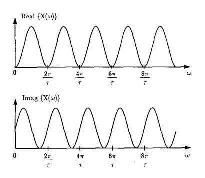
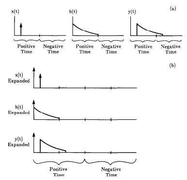
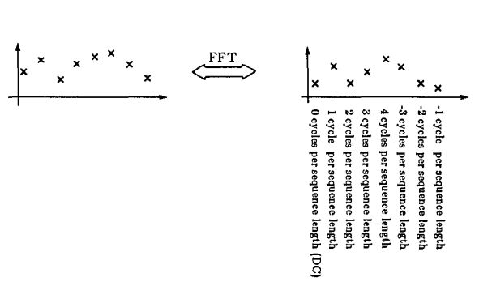
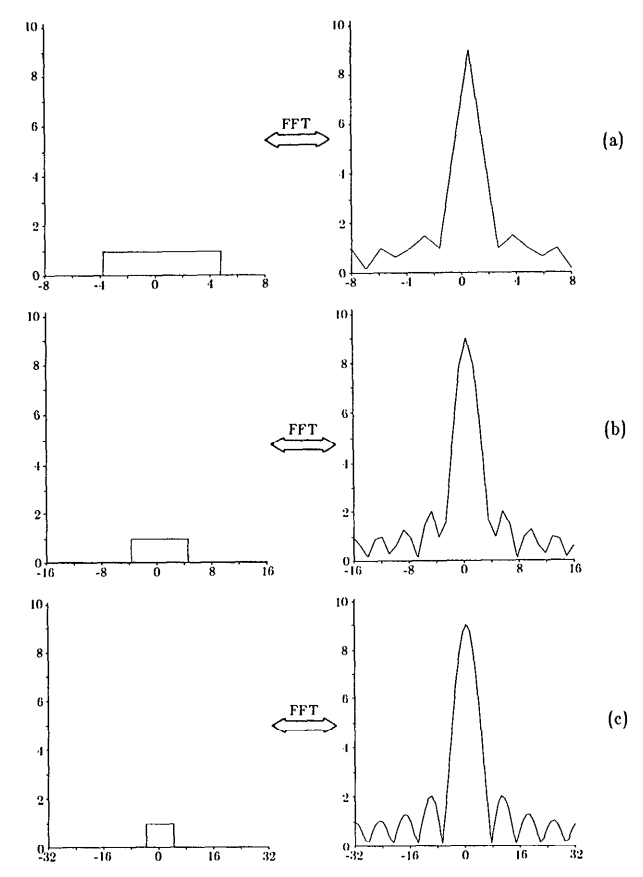

One-Dimensional Signal Processing
---------------------------------

### Continuous and Discrete One-Dimensional Functions

  One-dimensional continuous functions, such as in Fig. 2.1(a), will be
represented in this book by the notation

$$x(t)$$

where $$x(t)$$ denotes the value as a function at $$t$$. This function may be given a discrete representation by sampling its value over a set of points as illustrated in Fig. 2.1(b). Thus the discrete representation can be expressed as the list

$$ \cdot\cdot\cdot, x(-\tau), x(0), x(\tau), x(2\tau), \cdot\cdot\cdot,x(n\tau) \cdot\cdot\cdot$$

As an example of this, the discrete representation of the data in Fig. 2.1(c) is

$$1, 3, 4, 5, 4, 3, 1$$


It is also possible to represent the samples as a single vector in a multidimensional space. For example, the set of seven samples could also be represented as a vector in a 7-dimensional space, with the first element of the vector equal to 1, the second equal to 3, and so on.

  There is a special function that is often useful for explaining operations on functions. It is called the Dirac delta or impulse function. It can’t be defined directly; instead it must be expressed as the limit of a sequence of functions. First we define a new function called rect (short for rectangle) as follows

$$ rect\>(t) =
\left\{
 \begin{array}{lr}
   1 \quad |t| < \frac{1}{2}\\
   0 \quad elsewhere
 \end{array}
\right.
$$

This is illustrated in Fig. 2.2(a). Consider a sequence of functions of ever decreasing support on the t-axis as described by

$$\delta_n(t) = n \> rect \> (nt)$$

and illustrated in Fig. 2.2(b). Each function in this sequence has the same area but is of ever increasing height, which tends to infinity as $$ n \to \infty$$. The limit of this sequence of functions is of infinite height but zero width in such a manner that the area is still unity. This limit is often pictorially represented as shown in Fig. 2.2(c) and denoted by $$\delta(t)$$. Our explanation leads to the definition of the Dirac delta function that follows

$$\int_{-\infty}^{\infty}\delta(t)dt = 1$$

  The delta function has the following “sampling” property

$$\int_{-\infty}^{\infty}x(t)\delta(t-t')dt = x(t')$$


where $$\delta(t-t')$$  is an impulse shifted to the location $$t = t’$$ . When an impulse enters into a product with an arbitrary $$x(t)$$, all the values of $$x(t)$$ outside the location $$t = t’$$ are disregarded. Then by the integral property of the delta function we obtain (7); so we can say that $$\delta(t-t')$$ samples the function $$x(t)$$ at $$t’$$.

###Linear Operations

  Functions may be operated on for purposes such as filtering, smoothing, etc. The application of an operator $$O$$ to a function $$x(t)$$ will be denoted by

$$O[x(t)]$$

The operator is linear provided

$$O[\alpha x(t)+\beta y(t)]=\alpha O[x(t)]+\beta O[y(t)]$$

for any pair of constants $$\alpha$$ and $$\beta$$ and for any pair of functions $$x(t)$$ and $$y(t)$$.
  
  An interesting class of linear operations is defined by the following integral form

$$z(t)=\int_{-\infty}^{\infty}x(t')h(t,t')dt'$$

where $$h$$ is called the impulse response. It is easily shown that $$h$$ is the system response of the operator applied to a delta function. Assume that the input function is an impulse at $$t = t_0$$ or

$$x(t)=\delta(t-t_0)$$

Substituting into (10), we obtain

$$z(t)=\int_{-\infty}^{\infty}\delta(t-t_0)h(t,t')dt'$$

Therefore $$h(t, t')$$ can be called the impulse response for the impulse applied at $$t'$$.

  A linear operation is called shift invariant when

$$y(t)=O[x(t)]$$

implies

$$y(t-\tau)=O[x(t-\tau)]$$

or equivalently

$$h(t, t')=h(t-t')$$

This implies that when the impulse is shifted by $$t'$$, so is the response, as is further illustrated in Fig. 2.3. In other words, the response produced by the linear operation does not vary with the location of the impulse; it is merely shifted by the same amount.

  For shift invariant operations, the integral form in (10) becomes
  
$$z(t)=\int_{-\infty}^{\infty}x(t')h(t-t')dt'$$
  
This is now called a convolution and is represented by

$$z(t) = x(t)*h(t)$$

The process of convolution can be viewed as flipping one of the two functions, shifting one with respect to the other, multiplying the two and integrating the product for every shift as illustrated by Fig. 2.4.


  Convolution can also be defined for discrete sequences. If

$$x_i=x(i\tau)$$

and

$$y_i=y(i\tau)$$

then the convolution of $$x_i$$ with $$y_i$$ can be written as

$$y_i = \tau \sum\limits_{j=-\infty}^\infty x_jh_{i-j}$$

This is a discrete approximation to the integral of (17).

### Fourier Representation

  For many purposes it is useful to represent functions in the frequency domain. Certainly the most common reason is because it gives a new perspective to an otherwise difficult problem. This is certainly true with the convolution integral; in the time domain convolution is an integral while in the frequency domain it is expressed as a simple multiplication.
  
  In the sections to follow we will describe four different varieties of the Fourier transform. The continuous Fourier transform is mostly used in theoretical analysis. Given that with real world signals it is necessary to periodically sample the data, we are led to three other Fourier transforms that approximate either the time or frequency data as samples of the continuous functions. The four types of Fourier transforms are summarized in Table 2.1.


**Table 2.1**:Four different Fourier transforms can be defined by sampling the time and frequency domains.

|                      | Continuous Time | Discrete Time |
|----------------------|-----------------|---------------|
| Continuous Frequency |Name: Fourier Transform <br> Forward:$$\>X(\omega)=\int_{-\infty}^{\infty}x(t)e^{-j\omega t}dt$$ <br> Inverse: $$x(t)= 1/2\int_{-\infty}^{\infty}X(\omega)e^{j\omega t}d\omega$$ <br> Periodicity: None|Name: Discrete Fourier Transform <br> Forward:$$\>X(\omega)=\sum\limits_{n = -\infty}^{\infty}x(n\tau)e^{-j\omega n\tau}$$ <br> Inverse: $$x(n\tau)= \tau/2\pi\int_{-\pi/\tau}^{\pi/\tau}X(\omega)e^{j\omega n\tau}d\omega$$ <br> Periodicity: $$X(\omega) = X(\omega + i(2\pi/\tau))$$|
| Discrete Frequency   |Name: Fourier Series <br> Forward:$$\>X_n=1/T\int_{0}^{T}x(t)e^{-jn(2\pi/T)t}dt$$ <br> Inverse: $$x(t)= \sum\limits_{n = -\infty}^{\infty}X_ne^{jn(2\pi/T)t}$$ <br> Periodicity: $$x(t)=x(t+iT)$$|Name: Discrete Fourier Transform <br> Forward:$$\>X_k=1/N\sum\limits_{n = 0}^{N}x_ne^{-j(2\pi/N)kn}$$ <br> Inverse: $$x_k= \sum\limits_{n = 0}^{N}X_ne^{j(2\pi/N)kn}$$ <br> Periodicity: $$x_k=x_{k+iN}$$ and $$X_k = X_{k+iN}$$|

  Assume that we have a continuous function $$x(t)$$ defined for $$T_1 \leq t \leq T_2$$. This function can be expressed in the following form:

$$x(t) = \sum\limits_{k=-\infty}^\infty z_ke^{jk\omega_0t}$$

where $$j = \sqrt{-1}$$ and $$w_0 - 2\pi f_0 - 2\pi/T$$, $$T - T_2 - T_1$$, and $$z_k$$ are complex coefficients to be discussed shortly. What is being said here is that $$x(t)$$ is the sum of a number of functions of the form

$$e^{jkw_0t}$$

This function represents

$$e^{jkw_0t} = cos (kw_0t) + j\>sin (kw_0t)$$

The two functions on the right-hand side, commonly referred to as sinusoids, are oscillatory with $$kf_0$$ cycles per unit of $$t$$ as illustrated by Fig. 2.5. $$kf_0$$ is called the frequency of the sinusoids. Note that the sinusoids in (24) are at multiples of the frequency $$f_0$$, which is called the fundamental frequency.


The coefficients $$z_k$$ in (22) are called the complex amplitude of the $$k$$th component, and can be obtained by using the following formula

$$z_k = \frac{1}{T}\int_{T_1}^{T_2}(t)e^{-jkw_0T}dt$$

The representation in (22) is called the Fourier Series. To illustrate pictorially the representation in (22), we have shown in Fig. 2.6, a triangular function and some of the components from the expansion.


  A continuous signal $$x(t)$$ defined for $$t$$ between $$-\infty$$ and $$\infty$$ also possesses another Fourier representation called the continuous Fourier transform and defined by

$$X(\omega) = \int_{-\infty}^{\infty} x(t)e^{-j\omega t}dt$$

One can show that this relationship may be inverted to yield

$$x(t) = \frac{1}{2\pi}\int_{-\infty}^{\infty} X(\omega)e^{-j\omega t}d\omega$$

Comparing (22) and (27), we see that in both representations, $$x(t)$$ has been expressed as a sum of sinusoids, $$e^{j\omega t}$$; the difference being that in the former, the frequencies of the sinusoids are at multiples of $$\omega_0$$, whereas in the latter we have all frequencies between $$-\infty$$ to $$\infty$$. The two representations are not independent of each other. In fact, the series representation is contained in the continuous transform representation since $$z_k$$’s in (25) are similar to $$x(\omega)$$ in (26) for $$\omega = k\omega_0 = k(2\pi/T)$$, especially if we assume that $$x(t)$$ is zero outside $$[T_1, T_2]$$, in which case the range of integration in (27) can be cut down to $$[T_1, T_2]$$. For the case when $$x(t)$$ is zero outside $$[T_1, T_2]$$, the reader might ask that since one can recover $$x(t)$$ from $$z_k$$ using (22), why use (27) since we require $$X(\omega)$$ at frequencies in addition to $$k\omega_0$$’s. The information in $$X(\omega)$$ for $$\omega \neq k_{\omega_0}$$ is necessary to constrain the values of $$x(t)$$ outside the interval $$[T_1, T_2]$$.

  If we compute $$z_k$$’s using (25), and then reconstruct $$x(t)$$ from $$z_k$$’s using (22), we will of course obtain the correct values of $$x(t)$$ within $$[T_1, T_2]$$; however, if we insist on carrying out this reconstruction outside $$[T_1, T_2]$$, we will obtain periodic replications of the original $$x(t)$$ (see Fig. 2.7). On the other hand, if $$X(\omega)$$ is used for reconstructing the signal, we will obtain $$x(t)$$ within $$[T_1, T_2]$$ and zero everywhere outside.


  The continuous Fourier transform defined in (26) may not exist unless $$x(t)$$ satisfies certain conditions, of which the following are typical [Goo68]:

1. $$\int_{-\infty}^{\infty}|x(t)|dt < \infty$$ <div></div>
2. $$g(t)$$ must have only a finite number of discontinuities and a finite number of maxima and minima in any finite interval.
3. $$g(t)$$ must have no infinite discontinuities.


  Some useful mathematical functions, like the Dirac $$\delta$$ function, do not obey the preceding conditions. But if it is possible to represent these functions as limits of a sequence of well-behaved functions that do obey these conditions then the Fourier transforms of the members of this sequence will also form a sequence. Now if this sequence of Fourier transforms possesses a limit, then this limit is called the “generalized Fourier transform” of the original function. Generalized transforms can be manipulated in the same manner as the conventional transforms, and the distinction between the two is generally ignored; it being understood that when a function fails to satisfy the existence conditions and yet is said to have a transform, then the generalized transform is actually meant [Goo68], [Lig60].

  Various transforms described in this section obey many useful properties; these will be shown for the two-dimensional case in Section 2.2.4. Given a relationship for a function of two variables, it is rather easy to suppress one and visualize the one-dimensional case; the opposite is usually not the case.

### Discrete Fourier Transform (DFT)

  As in the continuous case, a discrete function may also be given a
frequency domain representation:

$$X(\omega)=\sum\limits_{n = -\infty}^{\infty}x(n\tau)e^{-j\omega n\tau}$$

where $$x(n\tau)$$ are the samples of some continuous function $$x(t)$$, and $$X(\omega)$$ the frequency domain representation for the sampled data. *(In this book we will generally use lowercase letters to represent functions of time or space and the uppercase letters for functions in the frequency domain.)*

  Note that our strategy for introducing the frequency domain representation is opposite of that in the preceding subsection. In describing Fourier series we defined the inverse transform (22), and then described how to compute its coefficients. Now for the DFT we have first described the transform from time into the frequency domain. Later in this section we will describe the inverse transform.

  As will be evident shortly, $$X(\omega)$$ represents the complex amplitude of the sinusoidal component $$e^{j\omega\tau n}$$ of the discrete signal. Therefore, with one important difference, $$X(\omega)$$ plays the same role here as $$z_k$$ in the preceding subsection; the difference being that in the preceding subsection the frequency domain representation was discrete (since it only existed at multiples of the fundamental frequency), while the representation here is continuous as $$X(\omega)$$ is defined for all $$\omega$$.

  For example, assume that
  
$$ x(n\tau) =
\left\{
 \begin{array}{lr}
   1 \quad n = 0\\
  -1 \quad n = 1\\
   0 \quad elsewhere
 \end{array}
\right.
$$

For this signal

$$X(\omega) = 1 - e^{-j\omega\tau}$$

Note that $$X(\omega)$$ obeys the following periodicity

$$X(\omega) = X(\omega + \frac{2\pi}{\tau})$$

which follows from (28) by simple substitution. In Fig. 2.8 we have shown several periods of this $$X(\omega)$$.



<div></div>$$X(\omega)$$ is called the discrete Fourier transform of the function $$x(n\tau)$$. From the DFT, the function $$x(n\tau)$$ can be recovered by using

$$x(n\tau)=\frac{\tau}{2\pi}\int_{-\pi/\tau}^{\pi/\tau}X(\omega)e^{j\omega n\tau}d\omega$$

which points to the discrete function $$x(n\tau)$$ being a sum (an integral sum, to bemore specific) of sinusoidal components like $$e^{j\omega n\tau}$$.

  An important property of the DFT is that it provides an alternate method for calculating the convolution in (21). Given a pair of sequences $$x_i = x(i\tau)$$ and $$h_i = h(i\tau)$$, their convolution as defined by

$$y_i = \sum\limits_{j=-\infty}^{\infty}x_jh_{i-j}$$

can be calculated from

$$Y(\omega)=X(\omega)H(\omega)$$

This can be derived by noting that the DFT of the convolution is written as

$$Y(\omega) = \sum\limits_{i=-\infty}^{\infty}\left[\sum\limits_{j=-\infty}^{\infty}x_jh_{i-j}\right]e^{-j\omega i\tau}$$

Rewriting the exponential we find

$$Y(\omega) = \sum\limits_{i=-\infty}^{\infty}\left[\sum\limits_{j=-\infty}^{\infty}x_jh_{i-j}\right]e^{-j\omega(i-k+k)\tau}$$

The second summation now can be written as

$$Y(\omega) = \sum\limits_{k=-\infty}^{\infty}x_k e^{-j\omega k\tau} \sum\limits_{m=-\infty}^{\infty}h_m e^{-j\omega m\tau}$$

Note that the limits of the summation remain from $$-\infty$$ to $$\infty$$. At this point itis easy to see that

$$Y(\omega)=X(\omega)H(\omega)$$

A dual to the above relationship can be stated as follows. Let’s multiply two discrete functions, $$x_n$$ and $$y_n$$ , each obtained by sampling the corresponding continuous function with a sampling interval of $$\tau$$ and call the resulting sequence $$z_n$$

$$z_n = x_n y_n$$

Then the DFT of the new sequence is given by the following convolution in
the frequency domain

$$Z(\omega)=\frac{\tau}{2\pi}\int_{-\pi/\tau}^{\pi/\tau}X(\alpha)Y(\omega - \alpha)d\alpha$$

### Finite Fourier Transform

  Consider a discrete function

$$x(0),x(\tau),x(2\tau),\cdot\cdot\cdot,x((N-1)\tau)$$

that is $$N$$ elements long. Let’s represent this sequence with the following subscripted notation

$$x_0,x_1,x_2,\>\cdot\cdot\cdot\> x_{N-1}$$

Although the DFT defined in Section 2.1.4 is useful for many theoretical discussions, for practical purposes it is the following transformation, called the finite Fourier transform (FFT), that is actually calculated with a computer:

$$X_u = \frac{1}{N}\sum\limits_{n=0}^{N-1}x_ne^{-j(2\pi/N)un}$$

for $$u = 0, 1, 2,\>\cdot\cdot\cdot, N - 1$$. To explain the meaning of the values $$X_u$$,rewrite (43) as

$$X(u\frac{1}{N\tau}) = \frac{1}{N}\sum\limits_{n=0}^{N-1}x(n\tau)e^{-j2\pi(u(1/N\tau))n\tau}$$

Comparing (44) and (28), we see that the $$X_u$$‘s are the samples of the continuous function $$X(\omega)$$ for

<center>$$\omega = u \frac{1}{N\tau}$$ with $$u = 0, 1, 2,\>\cdot\cdot\cdot, N - 1$$</center>

Therefore, we see that if (43) is used to compute the frequency domain representation of a discrete function, a sampling interval of $$\tau$$ in the $$t$$-domain implies a sampling interval of $$l/N\tau$$ in the frequency domain. The inverse of the relationship shown in (43) is

$$x_n = \sum\limits_{u=0}^{N-1}X_ue^{j(2\pi/N)un},\quad \quad n = 0, 1, 2,\>\cdot\cdot\cdot, N - 1$$

  Both (43) and (46) define sequences that are periodically replicated. First consider (43). If the $$u = Nm + i$$ term is calculated then by noting that $$e^{j(2\pi/N)Nm} = 1$$ for all integer values of $$m$$, it is easy to see that

$$X_{Nm+i} = X_i$$

A similar analysis can be made for the inverse case so that

$$x_{Nm+i} = x_i$$

  When the finite Fourier transforms of two sequences are multiplied the result is still a convolution, as it was for the discrete Fourier transform defined in Section 2.1.4, but now the convolution is with respect to replicated sequences. This is often known as circular convolution because of the effect discussed below.

  To see this effect consider the product of two finite Fourier transforms. First write the product of two finite Fourier transforms

$$Z_u = X_uY_u$$

and then take the inverse finite Fourier transform to find

$$z_n = \sum\limits_{u=0}^{N-1}e^{j(2\pi/N)un}X_uY_u$$

Substituting the definition of $$X_u$$ and $$Y_u$$ as given by (43) the product can now be written

$$z_n = \frac{1}{N^2}\sum\limits_{u=0}^{N-1}e^{j(2\pi/N)un}\sum\limits_{i=0}^{N-1}x_ie^{j(2\pi/N)iu}\sum\limits_{k=0}^{N-1}y_ke^{j(2\pi/N)ku}$$

The order of summation can be rearranged and the exponential terms combined to find

$$z_n = \frac{1}{N^2}\sum\limits_{i=0}^{N-1}\sum\limits_{k=0}^{N-1}x_iy_k\sum\limits_{u=0}^{N-1}e^{j(2\pi/N)un-ui-uk}$$

There are two cases to consider. When $$n - i - k \neq 0$$ then as a function of $$u$$ the samples of the exponential $$e^{j(2\pi/N)un-ui-uk}$$ represent an integral number of cycles of a complex sinusoid and their sum is equal to zero. On the other hand, when $$i = n - k$$ then each sample of the exponential is equal to one and thus the summation is equal to $$N$$. The summation in (52) over $$i$$ and $$k$$ represents a sum of all the possible combinations of $$x_i$$ and $$y_k$$. When $$i = n - k$$ then the combination is multiplied by a factor of $$N$$ while when $$i \neq n - k$$ then the term is ignored. This means that the original product of two finite Fourier transforms can be simplified to

$$z_n = \frac{1}{N}\sum\limits_{k=0}^{N-1}x_{n-k}y_k$$

  This expression is very similar to (21) except for the definition of $$x_{n-k}$$ and $$y_k$$ for negative indices. Consider the case when $$n = 0$$. The first term of the summation is equal to $$x_0y_0$$ but the second term is equal to $$x_{-1}y_1$$ . Although in the original formulation of the finite Fourier transform, the x sequence was only specified for indices from $$0$$ through $$N - 1$$, the periodicity property in (48) implies that $$x_{-1}$$ be equal to $$X_{N-1}$$. This leads to the name circular convolution since the undefined portions of the original sequence are replaced by a circular replication of the original data.
  
  The effect of circular convolution is shown in Fig. 2.9(a). Here we have shown an exponential sequence convolved with an impulse. The result represents a circular convolution and not samples of the continuous convolution.

  A circular convolution can be turned into an aperiodic convolution by zeropadding the data. As shown in Fig. 2.9(b) if the original sequences are doubled in length by adding zeros then the original $$N$$ samples of the product sequence will represent an aperiodic convolution of the two sequences.

  Efficient procedures for computing the finite Fourier transform are known as fast Fourier transform (FFT) algorithms. To calculate each of the $$N$$ points of the summation shown in (43) requires on the order of $$N^2$$ operations. In a fast Fourier transform algorithm the summation is rearranged to take advantage of common subexpressions and the computational expense is reduced to $$N$$ log $$N$$. For a 1024 point signal this represents an improvement by a factor of approximately 100. The fast Fourier transform algorithm has revolutionized digital signal processing and is described in more detail in [Bri74].



### Just How Much Data Is Needed

  In Section 2.1.1 we used a sequence of numbers $$x_i$$ to approximate a continuous function $$x(t)$$. An important question is, how finely must the data be sampled for $$x_i$$ to accurately represent the original signal? This question was answered by Nyquist who observed that a signal must be sampled at least twice during each cycle of the highest frequency of the signal. More rigorously, if a signal $$x(t)$$ has a Fourier transform such that

<center>$$X(\omega)=0\quad$$ for $$\omega \geq \frac{\omega_N}{2}$$</center>

then samples of $x$ must be measured at a rate greater than $$\omega_N$$. In other words, if $$T$$ is the interval between consecutive samples, we want $$2\pi/T \geq \omega_N$$. The frequency $$\omega_N$$ is known as the Nyquist rate and represents the minimum frequency at which the data can be sampled without introducing errors.

  Since most real world signals aren’t limited to a small range of frequencies, it is important to know the consequences of sampling at below the Nyquist rate. We can consider the process of sampling to be equivalent to multiplication of the original continuous signal $$x(t)$$ by a sampling function given by

$$h(t) = \sum\limits_{-\infty}^{\infty}\delta(t-iT)$$

The Fourier transform of $$h(t)$$ can be computed from (26) to be

$$H(\omega) = (\frac{2\pi}{T})\sum\limits_{-\infty}^{\infty}\delta(\omega-\frac{2\pi i}{T})$$

By (40) we can convert the multiplication to a convolution in the frequency
domain. Thus the result of the sampling can be written

$$Z(\omega) = (\frac{2\pi}{T})\sum\limits_{i = -\infty}^{\infty} X(\omega-\frac{2i\pi}{T})$$

This result is diagrammed in Fig. 2.10.

  It is important to realize that when sampling the original data (Fig. 2.10(a)) at a rate faster than that defined by the Nyquist rate, the sampled data are an exact replica of the original signal. This is shown in Fig. 2.10(b). If the sampled signal is filtered such that all frequencies above the Nyquist rate are removed, then the original signal will be recovered.

  On the other hand, as the sampling interval is increased the replicas of the signal in Fig. 2.10(c) move closer together. With a sampling interval greater than that predicted by the Nyquist rate some of the information in the original data has been smeared by replications of the signal at other frequencies and the original signal is unrecoverable. (See Fig. 2.10(d).) The error caused by the sampling process is given by the inverse Fourier transform of the frequency information in the overlap as shown in Fig. 2.10(d). These errors are also known as aliasing.

![Sampling a waveform generates replications of the original Fourier transform of the object at periodic intervals. If the signal is sampled at a frequency of $$\omega$$ then the Fourier transform of the object will be replicated at intervals of $$2\omega$$. (a) shows the Fourier transform of the original signal, (b) shows the Fourier transform when $$x(t)$$ is sampled at a rate faster than the Nyquist rate, (c) when sampled at the Nyquist rate and finally (d) when the data are sampled at a rate less than the Nyquist rate.](../figures/2-10.png "Figure 2.10")

### Interpretations of the FFT Output

  Correct interpretation of the $$X_u$$’s in (43) is obviously important. Toward that goal, it is immediately apparent that $$X_0$$ stands for the average (or, what is more frequently called the dc) component of the discrete function, since from (43)

$$X_0 = \frac{1}{N}\sum\limits_{n=0}^{N-1}x_n$$

Interpretation of $$X_1$$ requires, perhaps, a bit more effort; it stands for 1 cycle per sequence length. This can be made obvious by setting $$X_1 = 1$$, while all other $$X_i$$’s are set equal to 0 in (46). We obtain

$$\begin{align}
x_n & = e^{j2(\pi/N)n} \\\\
& = cos(\frac{2\pi}{N}) + j\\ sin(\frac{2\pi}{N}) \\\\
\end{align}$$

for $$n = 0,1,2,\cdot\cdot\cdot, N - 1$$. A plot of either the cosine or the sine part of this expression will show just one cycle of the discrete function $$x_n$$, which is why we consider $$X_1$$, as representing one cycle per sequence length. One may similarly show that $$X_2$$ represents two cycles per sequence length. Unfortunately, this straightforward approach for interpreting $$X_u$$ breaks down for $$u \gt N/2$$. For these high values of the index $$u$$, we make use of the following periodicity property

$$X_{-u}=X_{N-u}$$

which is easily proved by substitution in (43). For further explanation, consider now a particular value for $$N$$, say 8. We already know that

From the periodicity property we can now add the following

```
$$X_0$$ represents dc
$$X_1$$ represents 1 cycle per sequence length
$$X_2$$ represents 2 cycles per sequence length
$$X_3$$ represents 3 cycles per sequence length
$$X_4$$ represents 4 cycles per sequence length.

From the periodicity property we can now add the following

$$X_5$$ represents - 3 cycles per sequence length
$$X_6$$ represents - 2 cycles per sequence length
$$X_7$$ represents - 1 cycle per sequence length.

```

Note that we could also have added "$$X_4$$ represents - 4 cycles per sequence length." The fact is that for any $$N$$ element sequence, $$X_{N/2}$$ will always be equal to $$X_{-N/2}$$ since from (43)

$$X_{N/2} = X_{-N/2} = \sum\limits_0^{N-1}x_n(-1)^n$$


  The discussion is diagrammatically represented by Fig. 2.11, which shows that when an $$N$$ element data sequence is fed into an FFT program, the output sequence, also $$N$$ elements long, consists of the dc frequency term, followed by positive frequencies and then by negative frequencies. This type of an output where the negative axis information follows the positive axis information is somewhat unnatural to look at.



  To display the FFT output with a more natural progression of frequencies, we can, of course, rearrange the output sequence, although if the aim is merely to filter the data, it may not be necessary to do so. In that case the filter transfer function can be rearranged to correspond to the frequency assignments of the elements of the FFT output.

  It is also possible to produce normal-looking FFT outputs (with dc at the center between negative and positive frequencies) by "modulating" the data prior to taking the FFT. Suppose we multiply the data with $$(-1)^n$$ to produce a new sequence $$x_n^{,}$$

$$x_n^{,} = x_n(-1)^n$$

Let $$X_u^{,}$$ designate the FFT of this new sequence. Substituting (63) in (43), we obtain

$$X_u^{,} = X_{u - N/2}$$

for $$u = 0,1,2,\cdot\cdot\cdot, N - 1$$. This implies the following equivalences

$$\begin{align}
X_0^{,} & = X_{-N/2} \\
X_1^{,} & = X_{-N/2+1} \\
X_2^{,} & = X_{-N/2+2} \\
X_{N/2}^{,} & = X_{0} \\
X_{N-1}^{,} & = X_{N/2-1} \\
\end{align}$$

### How to Increase the Display Resolution in the Frequency Domain

  The right column of Fig. 2.12 shows the magnitude of the FFT output (the dc is centered) of the sequence that represents a rectangular function as shown in the left column. As was mentioned before, the Fourier transform of a discrete sequence contains all frequencies, although it is periodic, and the FFT output represents the samples of one period. For many situations, the frequency domain samples supplied by the FFT, although containing practically all the information for the reconstruction of the continuous Fourier transform, are hard to interpret visually. This is evidenced by Fig. 2.12(a), where for part of the display we have only one sample associated with an oscillation in the frequency domain. It is possible to produce smootherlooking outputs by what is called zero-padding the data before taking the FFT. For example, if the sequence of Fig. 2.12(a) is extended with zeros to twice its length, the FFT of the resulting 32 element sequence will be as shown in Fig. 2.12(b), which is visually smoother looking than the pattern in Fig. 2.12(a). If we zero-pad the data to four times its original length, the output is as shown in Fig. 2.12(c).

