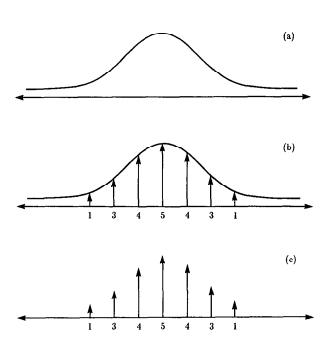

One-Dimensional Signal Processing
---------------------------------

###Continuous and Discrete One-Dimensional Functions

  One-dimensional continuous functions, such as in Fig. 2.1(a), will be
represented in this book by the notation

$$x(t)$$

where $$x(t)$$ denotes the value as a function at $$t$$. This function may be given a
discrete representation by sampling its value over a set of points as illustrated
in Fig. 2.1(b). Thus the discrete representation can be expressed as the list

$$ \cdot\cdot\cdot, x(-\tau), x(0), x(\tau), x(2\tau), \cdot\cdot\cdot,x(n\tau) \cdot\cdot\cdot$$

As an example of this, the discrete representation of the data in Fig. 2.1(c) is

$$1, 3, 4, 5, 4, 3, 1$$

It is also possible to represent the samples as a single vector in a multidimensional space. For example, the set of seven samples could also be represented as a vector in a 7-dimensional space, with the first element of the vector equal to 1, the second equal to 3, and so on.

  There is a special function that is often useful for explaining operations on functions. It is called the Dirac delta or impulse function. It can’t be defined directly; instead it must be expressed as the limit of a sequence of functions. First we define a new function called rect (short for rectangle) as follows

$$ rect\>(t) =
\left\{
 \begin{array}{lr}
   1 \quad |t| < \frac{1}{2}\\
   0 \quad elsewhere
 \end{array}
\right.
$$

This is illustrated in Fig. 2.2(a). Consider a sequence of functions of ever
decreasing support on the t-axis as described by

$$\delta_n(t) = n \> rect \> (nt)$$

and illustrated in Fig. 2.2(b). Each function in this sequence has the same area but is of ever increasing height, which tends to infinity as $$ n \to \infty$$. The limit of this sequence of functions is of infinite height but zero width in such a manner that the area is still unity. This limit is often pictorially represented as shown in Fig. 2.2(c) and denoted by $$\delta(t)$$. Our explanation leads to the definition of the Dirac delta function that follows

$$\int_{-\infty}^{\infty}\delta(t)dt = 1$$

The delta function has the following “sampling” property

$$\int_{-\infty}^{\infty}x(t)\delta(t-t')dt = x(t')$$

where $$\delta(t-t')$$  is an impulse shifted to the location $$t = t’$$ . When an impulse enters into a product with an arbitrary $$x(t)$$, all the values of $$x(t)$$ outside the location $$t = t’$$ are disregarded. Then by the integral property of the delta function we obtain (7); so we can say that $$\delta(t-t')$$ samples the function $$x(t)$$ at $$t’$$.